# HarmonyOS 学习示例项目

这是一个 HarmonyOS 应用开发学习项目，包含了多个实用的功能示例。每个示例都提供了完整的实现代码和详细的说明文档。


## 功能示例列表

### 1. [倒计时按钮 (CountDown)](./entry/src/main/ets/pages/countdown/)
实现发送验证码场景的倒计时按钮功能。


**核心技术点：**
- 使用 setInterval 实现倒计时控制器
- 自定义倒计时按钮组件
- 支持自定义倒计时时长

### 2. [表情面板 (Emotion)](./entry/src/main/ets/pages/emotion/)
实现聊天应用中的表情选择面板，支持 emoji 表情和图片表情。


**核心技术点：**
- 使用 Swiper + Grid 实现表情面板
- 懒加载 DataSource 优化性能
- 支持 emoji 和自定义图片表情

### 3. [文本展开收起 (ExpandText)](./entry/src/main/ets/pages/expandtext/)
实现文本内容的展开和收起功能，支持指定行数限制。


**核心技术点：**
- 使用 getMeasureUtils().measureTextSize 计算文本高度
- 动态计算指定行数所需显示的文本内容
- 支持自定义展开/收起按钮样式

### 4. [异形 Banner (IrRectangle)](./entry/src/main/ets/pages/irrectangle/)
实现左右两边非矩形的异形轮播图效果。

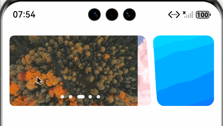

**核心技术点：**
- 使用 maskShape 和 PathShape 实现异形裁剪
- SVG 路径绘制自定义形状
- 单位转换 vp2px

### 5. [位置信息获取 (Location)](./entry/src/main/ets/pages/location/)
获取用户当前位置的国家、城市、区县等地理信息。

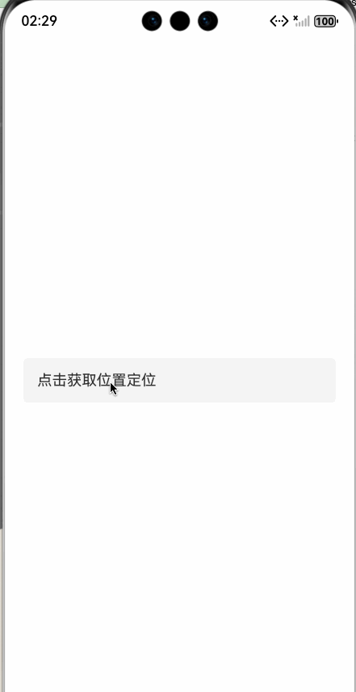

**核心技术点：**
- 位置权限申请和管理
- 使用 geoLocationManager 获取位置
- 逆地理编码转换坐标为地址信息

### 6. [金刚区菜单 (Menu)](./entry/src/main/ets/pages/menu/)
实现带滚动下标的金刚区菜单布局。

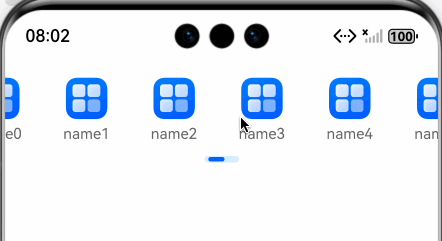

**核心技术点：**
- 横向 List 实现金刚区
- 滚动进度计算
- 下标同步滚动效果

### 7. [自定义 Emitter (MyEmitter)](./entry/src/main/ets/pages/myemitter/)
实现支持 Object 类型作为 key 的自定义事件发射器。

**核心技术点：**
- 使用 Map 存储观察者
- 支持泛型回调
- 简化事件监听和取消监听

### 8. [导航栏渐变 (NavbarGradient)](./entry/src/main/ets/pages/navbargradient/)
实现沉浸式导航栏的渐变显示效果。

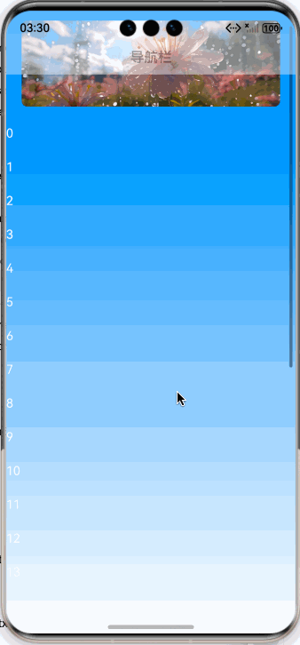

**核心技术点：**
- 沉浸式布局设置
- 监听滚动偏移量动态调整透明度
- Stack 布局实现层叠效果

### 9. [本地通知 (Notification)](./entry/src/main/ets/pages/notification/)
实现本地通知功能，支持自定义提示音和点击唤起应用。

**核心技术点：**
- 本地通知权限申请
- 自定义通知内容和样式
- 通知点击事件处理

### 10. [OSS 文件上传 (OSS)](./entry/src/main/ets/pages/oss/)
实现图片上传到阿里云 OSS 的功能。


**核心技术点：**
- 使用 @aliyun/oss SDK
- 封装统一的上传工具类
- 图片选择和沙箱文件处理

### 11. [画中画 (PIP)](./entry/src/main/ets/pages/pip/)
实现视频播放的画中画功能。

**核心技术点：**
- 画中画模式切换
- 视频播放控制
- 窗口大小和位置管理

### 12. [路由管理 (Router)](./entry/src/main/ets/pages/router/)
自定义路由管理工具。

**核心技术点：**
- 路由注册和管理
- 页面跳转和参数传递
- 路由拦截和权限控制

### 13. [横竖屏切换 (ScreenRotate)](./entry/src/main/ets/pages/screenrotate/)
实现视频播放或图表展示时的横竖屏切换。


**核心技术点：**
- 使用 setPreferredOrientation 控制屏幕方向
- 沉浸式全屏效果
- 横竖屏不同布局适配

### 14. [搜索高亮 (Search)](./entry/src/main/ets/pages/search/)
实现搜索关键词高亮显示功能。

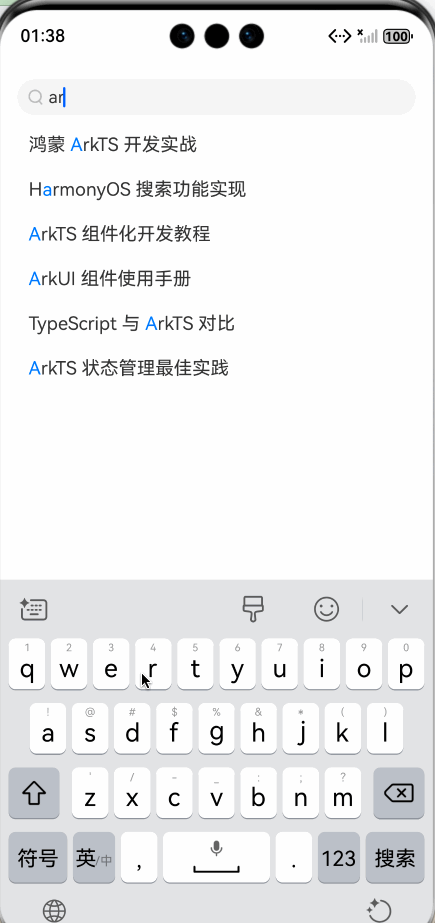

**核心技术点：**
- 自定义搜索框组件
- 关键词拆分和节点生成
- 使用 Text + Span 实现高亮效果

### 15. [文本选择菜单 (SelectableText)](./entry/src/main/ets/pages/selectabletext/)
实现聊天消息的长按选择和复制功能。

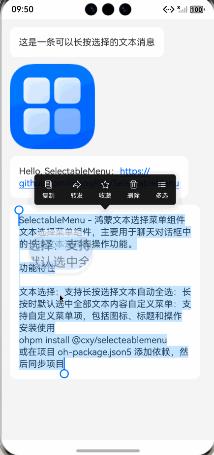

**核心技术点：**
- 使用 @cxy/selecteablemenu 三方库
- 自定义选择菜单项
- 支持文本选择和全选

### 16. [Swiper 动画 (SwiperAnimation)](./entry/src/main/ets/pages/swiperanimation/)
实现中间放大、两边缩小的轮播图效果。


**核心技术点：**
- 使用 customContentTransition 自定义切换动画
- 动态计算缩放比例和透明度
- 平滑的过渡效果

### 17. [表格布局 (Table)](./entry/src/main/ets/pages/table/)
实现支持上下左右滚动的表格布局。

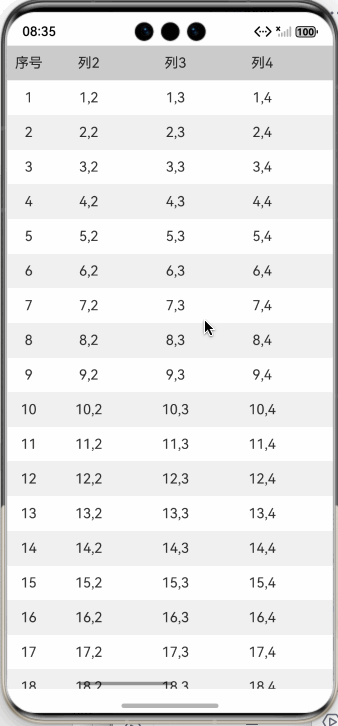

**核心技术点：**
- 左右分栏布局
- 使用 List + Scroll 实现双向滚动
- 表头吸顶效果
- 左右滚动同步

### 18. [视频转码 (Transcoder)](./entry/src/main/ets/pages/transcoder/)
实现 HDR 视频转 SDR 视频的功能。


**核心技术点：**
- 使用 AVTranscoder 实现视频转码
- 封装转码工具类
- 转码进度监听
- 文件大小对比

### 19. [Web 字体调整 (WebFont)](./entry/src/main/ets/pages/webfont/)
实现 Web 资讯页面的字体大小动态调整。


**核心技术点：**
- 使用 SegmentButton 实现字号选择
- 通过 textZoomRatio 调整 Web 字体
- 半模态弹窗交互

### 20. [负一屏 (Blur)](./entry/src/main/ets/pages/blur/)
实现从主屏向右滑动打开的负一屏展示效果。


**核心技术点：**
- 使用滑动手势控制负一屏的打开与关闭
- 通过 backdropBlur 实现背景模糊效果
- 动态计算位移与模糊半径
- 支持手势冲突处理与动画回弹


### 21. [MaskShape 图形 (MaskShape)](./entry/src/main/ets/pages/maskshape/)
实现带斜切、圆角、渐变的自定义图形效果。


**核心技术点：**
- 使用 maskShape + PathShape 实现自定义形状遮罩
- SVG 路径命令绘制带斜切和圆角的形状
- 二次贝塞尔曲线（Q 命令）实现圆角过渡
- Shape + Path 实现描边与遮罩同步
- vp2px 单位转换适配动态尺寸
- linearGradient 渐变填充

  
  
### 22. [Tab嵌套Scroll](./entry/src/main/ets/pages/tabscroll)
Tab 嵌套 Scroll 使用左右滑动冲突解决

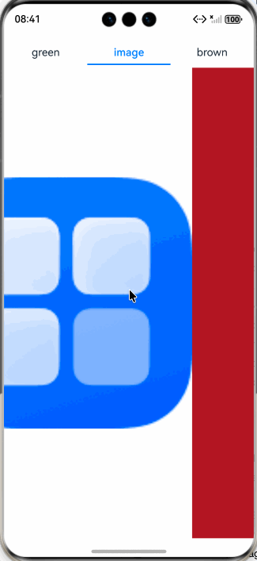

### 23. [Canvas 绘图与保存图片 (Canvas)](./entry/src/main/ets/pages/canvas/)
使用 Canvas 进行离屏绘图并保存到相册。

**核心技术点：**
- 使用 OffscreenCanvas 实现离屏渲染
- CanvasRenderingContext2D 绘制图形和文字
- 使用 image.ImagePacker 将 PixelMap 打包为 PNG
- 通过 photoAccessHelper 保存到系统相册

### 24. [HDS Tab 底部导航栏 (HdsTab)](./entry/src/main/ets/pages/hdstab/)
基于 UIDesignKit 实现 HDS 规范的底部 Tab 导航栏。

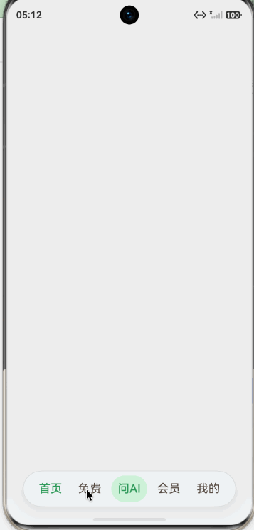

**核心技术点：**
- 使用 HdsNavigation + HdsTabs 构建标准底部导航
- barFloatingStyle 实现悬浮式底部栏
- 自定义 TabBar 样式（问AI按钮特殊处理）
- onContentWillChange 拦截 Tab 切换

### 25. [图片加载与尺寸适配 (ImageLoad)](./entry/src/main/ets/pages/imageload/)
通过网络请求加载图片并自动适配显示尺寸。

**核心技术点：**
- 使用 http 模块发起网络请求
- image.createImageSource 解析 ArrayBuffer 为图片
- 根据宽高比自动计算适配尺寸
- 区分宽图、高图、方图的不同缩放策略

### 26. [下拉放大 Header (PullDownHeader)](./entry/src/main/ets/pages/pulldownheader/)
实现列表下拉时 Header 图片放大回弹效果。

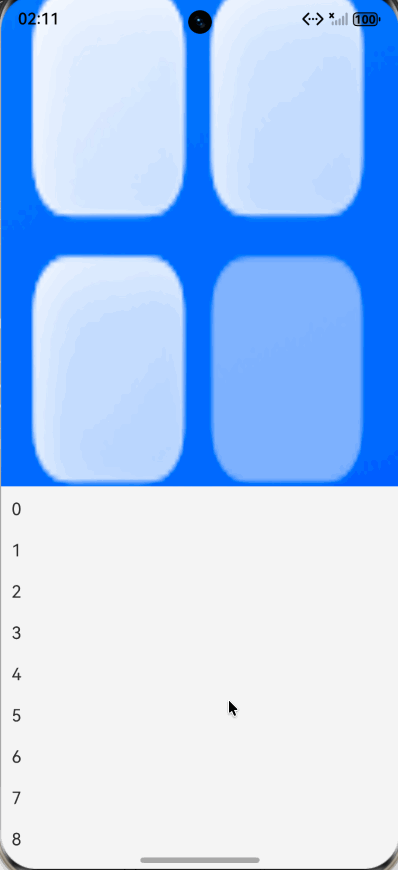

**核心技术点：**
- 监听 List onDidScroll 实现下拉距离计算
- 动态 scale 和 height 实现放大效果
- onScrollStop 回弹动画恢复
- Stack 布局实现 Header 悬浮覆盖

### 27. [沙箱文件夹压缩导出 (SaveFile)](./entry/src/main/ets/pages/savefile/)
实现沙箱目录浏览、文件夹压缩并导出到手机存储。

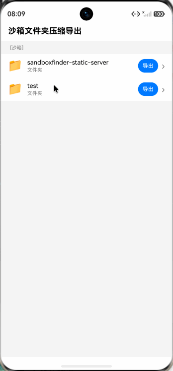

**核心技术点：**
- 沙箱目录浏览与导航
- zlib.compressFile 压缩文件夹为 zip
- DocumentViewPicker 选择保存路径
- 文件读写与临时文件清理

## 项目结构

```
harmony-study-demo/
├── AppScope/                    # 应用全局配置
│   ├── app.json5               # 应用配置文件
│   └── resources/              # 全局资源文件
├── entry/                      # 主模块
│   ├── src/
│   │   └── main/
│   │       ├── ets/
│   │       │   └── pages/      # 页面目录
│   │       │       ├── Index.ets              # 主入口页面
│   │       │       ├── blur/                  # 负一屏示例
│   │       │       ├── canvas/                # Canvas绘图示例
│   │       │       ├── countdown/             # 倒计时示例
│   │       │       ├── emotion/               # 表情面板示例
│   │       │       ├── expandtext/            # 文本展开示例
│   │       │       ├── hdstab/                # HDS Tab导航示例
│   │       │       ├── imageload/             # 图片加载示例
│   │       │       ├── irrectangle/           # 异形Banner示例
│   │       │       ├── location/              # 位置信息示例
│   │       │       ├── maskshape/             # MaskShape图形示例
│   │       │       ├── menu/                  # 金刚区示例
│   │       │       ├── myemitter/             # 自定义Emitter示例
│   │       │       ├── navbargradient/        # 导航栏渐变示例
│   │       │       ├── notification/          # 通知示例
│   │       │       ├── oss/                   # OSS上传示例
│   │       │       ├── pip/                   # 画中画示例
│   │       │       ├── pulldownheader/        # 下拉放大Header示例
│   │       │       ├── router/                # 路由示例
│   │       │       ├── savefile/              # 沙箱导出示例
│   │       │       ├── screenrotate/          # 横竖屏切换示例
│   │       │       ├── search/                # 搜索高亮示例
│   │       │       ├── selectabletext/        # 文本选择示例
│   │       │       ├── swiperanimation/       # Swiper动画示例
│   │       │       ├── table/                 # 表格布局示例
│   │       │       ├── tabscroll/             # Tab嵌套Scroll示例
│   │       │       ├── transcoder/            # 视频转码示例
│   │       │       └── webfont/               # Web字体示例
│   │       └── resources/      # 模块资源文件
│   └── oh-package.json5        # 模块依赖配置
├── oh_modules/                 # 依赖模块
├── build-profile.json5         # 构建配置
└── oh-package.json5            # 项目依赖配置
```

## 使用说明

1. 克隆项目到本地
2. 使用 DevEco Studio 打开项目
3. 等待依赖安装完成
4. 在 `entry/src/main/ets/pages/Index.ets` 中取消注释想要查看的示例组件
5. 运行项目到模拟器或真机


## 注意事项

1. 部分功能需要真机测试，模拟器可能不支持（如位置信息等）
2. OSS 上传功能需要配置自己的阿里云账号信息
3. 视频转码功能需要设备支持 AVTranscoder 能力
4. 使用前请确保已申请相应的权限（位置、相机、存储等）


# 作者

[@仙银](https://github.com/iHongRen)

鸿蒙开源作品，欢迎持续关注 [💖赞助](https://ihongren.github.io/donate.html)

1、[hpack](https://github.com/iHongRen/hpack) - 鸿蒙 HarmonyOS 一键打包上传分发测试工具。

2、[Open-in-DevEco-Studio](https://github.com/iHongRen/Open-in-DevEco-Studio)  - macOS 直接在 Finder 工具栏上，使用
DevEco-Studio 打开鸿蒙工程。

3、[cxy-theme](https://github.com/iHongRen/cxy-theme) - DevEco-Studio 绿色护眼背景主题。

4、[harmony-udid-tool](https://github.com/iHongRen/harmony-udid-tool) - 简单易用的 HarmonyOS 设备 UDID 获取工具，适用于非开发人员。

5、[SandboxFinder](https://github.com/iHongRen/SandboxFinder) - 鸿蒙沙箱文件浏览器，支持模拟器和真机。快速访问沙箱目录。

6、[WebServer](https://github.com/iHongRen/WebServer) - 鸿蒙轻量级Web服务器框架，类 Express.js API 风格，支持中间件，路由，静态服务。

7、[SelectableMenu](https://github.com/iHongRen/SelectableMenu) - 适用于聊天对话框中的文本选择菜单

8、[RefreshList](https://github.com/iHongRen/RefreshList) - 功能完善的上拉下拉加载组件，支持各种自定义。

