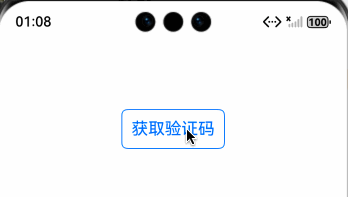

# 如何实现倒计时按钮？

比如发送验证码的倒计时按钮

##### 预览效果：



##### 实现步骤：

1、使用 setInterval 定时器实现一个倒计时控制器：

```extendtypescript
/**
 * @fileName : CountDownController.ets
 * @author : @cxy
 * @date : 2025/12/23
 * @description : 倒计时控制器
 */


export class CountDownController {
  private countdownTime: number = 60;
  // 定时器ID
  private countdownInterval: number = -1;
  // 结束回调函数
  private onCountdownFinish: () => void;
  // 倒计时tick的回调函数
  private onCountdownTick: (remainingTime: number) => void;

  constructor(onCountdownFinish: () => void, onCountdownTick?: (remainingTime: number) => void) {
    this.onCountdownFinish = onCountdownFinish;
    this.onCountdownTick = onCountdownTick || (() => {
    });
    this.countdownInterval = -1;
  }

  start(countdownTime: number): void {
    this.stop()
    this.countdownTime = countdownTime

    this.countdownInterval = setInterval(() => {
      this.countdownTime--;
      this.onCountdownTick(Math.max(this.countdownTime, 0));
      if (this.countdownTime <= 0) {
        this.stop();
        this.onCountdownFinish();
      }
    }, 1000);
  }

  stop(): void {
    if (this.countdownInterval > -1) {
      clearInterval(this.countdownInterval);
      this.countdownInterval = -1;
    }
  }
}
```

2、自定义倒计时按钮组件：

```extendtypescript
/**
 * @fileName : CountDownButton.ets
 * @author : @cxy
 * @date : 2025/12/23
 * @description : 倒计时按钮
 */


import { CountDownController } from './CountDownController'

@Component
export struct CountDownButton {
@Prop countDownTime: number = 60 //默认60秒
@State remainingTime: number = this.countDownTime
@Link @Watch("onStartTimer") startTimer: boolean;
@Prop fontSize: number = 18
private countDownController = new CountDownController(() => {
  this.startTimer = false
}, (time) => {
  this.remainingTime = time
})

onStartTimer() {
  if (this.startTimer) {
    this.remainingTime = this.countDownTime
    this.countDownController.start(this.countDownTime)
  } else {
    this.countDownController.stop()
  }
}

build() {
  Button() {
    Text(this.startTimer ? `重新获取(${this.remainingTime}s)` : '获取验证码')
      .fontSize(this.fontSize)
      .fontColor(this.startTimer ? '#444444' : '#0066ff')
  }
  .enabled(!this.startTimer)
  .backgroundColor(Color.Transparent)
  .padding(10)
  .borderRadius(6)
  .borderWidth(1)
  .borderColor(this.startTimer ? '#444444' : '#0066ff')
}
}
```

3、使用倒计时按钮示例：

```extendtypescript
/**
 * @fileName : CountDownDemo.ets
 * @author : @cxy
 * @date : 2025/12/22
 * @description : 文件描述
 */
import { CountDownButton } from "./CountDownButton"

@Component
export struct CountDownDemo {
@State startTimer: boolean = false

build() {
  Stack() {
    CountDownButton({
      startTimer: $startTimer,
      countDownTime: 5
    })
      .onClick(() => {
        // TODO: 调用发送验证码接口，成功后开启倒计时
        this.startTimer = true
      })
  }
  .width('100%')
  .height(200)
}
}
```

