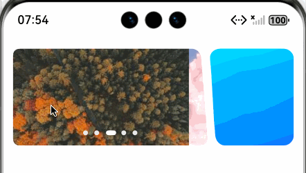

# 如何实现异形Banner

如图, 左右两边都不是正/长方形。


实现细节：
1、我们需要对形状进行裁剪，可以使用 maskShape 为组件上添加指定形状的遮罩。
2、maskShape 支持设置 CircleShape | EllipseShape | PathShape | RectShape 来指定遮罩的形状。
3、我们使用 PathShape ，它通过设置路径的绘制指令commands创建。
4、commands(value: ResourceStr)：设置符合SVG路径描述规范的命令字符串，单位为px。
5、那么就简化为通过svg实现特殊的形状。需要使用vp2px进行单位转换。

预览效果：


完整的demo:

```extendtypescript
/**
 * @fileName : Irrectangele.ets
 * @author : @cxy
 * @date : 2025/12/20
 * @description : 异形banner
 */

import { PathShape } from "@kit.ArkUI"

@Component
export struct Irrectange {
@State commands: string = ''
@State irHeight: number = 0
@State banners: string[] = [
  'https://picsum.photos/300/150?random=1',
  'https://picsum.photos/300/150?random=2',
  'https://picsum.photos/300/150?random=3',
  'https://picsum.photos/300/150?random=4',
  'https://picsum.photos/300/150?random=5'
]

build() {
  Row({ space: 3 }) {
    Swiper() {
      ForEach(this.banners, (item: string) => {
        Image(item)
          .width('100%')
      }, (item: string) => item)
    }
    .interval(5000)
    .loop(true)
    .indicator(
      new DotIndicator()
        .itemWidth(6)
        .itemHeight(6)
        .selectedItemWidth(12)
        .selectedItemHeight(6)
        .color('#eee')
        .selectedColor('#fff')
    )
    .layoutWeight(1)
    .borderRadius(8)
    .maskShape(new PathShape().commands(this.commands).fill(Color.White))
    .onAreaChange((oldValue: Area, newValue: Area) => {
      const ctx = this.getUIContext()
      this.irHeight = newValue.height as number
      const width = ctx.vp2px(newValue.width as number)
      const height = ctx.vp2px(this.irHeight)
      this.updateCommands(width, height)
    })

    Stack() {
      Image($r('app.media.irrect_right'))
        .width('100%')
        .height('100%')
        .resizable({
          slice: {
            top: 30,
            bottom: 30,
            left: 40,
            right: 40
          }
        })
    }
    .width(105)
    .height(this.irHeight)
  }
  .width('100%')
  .padding({ left: 12, right: 12 })
  .margin({ top: 20 })
}

updateCommands(width: number, height: number) {
  const ctx = this.getUIContext()
  const radius = ctx.vp2px(12)
  this.commands =
    `M0,0 L${width - ctx.vp2px(20)},0 A${radius},${radius} 0 0,1 ${width -
    ctx.vp2px(8)},${radius} L${width},${height -
      radius} L${width},${height} L0,${height} Z`
}
}
```