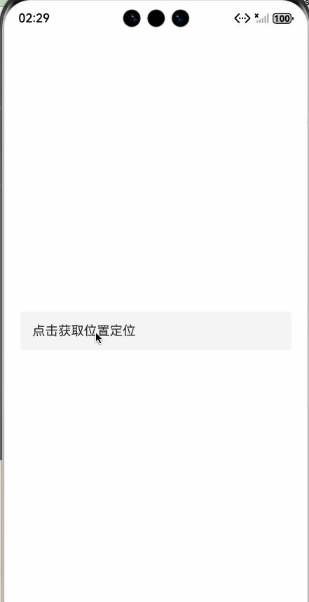

如何获取当前位置所在的国家城市区县，实现自动填充位置信息呢？




1、先配置位置权限

src/main/module.json5: 

```json
"requestPermissions": [
  {
    "name": "ohos.permission.LOCATION",
    "reason": "$string:location_use_reason",
    "usedScene": {
      "when": "inuse"
    }
  },
  {
    "name": "ohos.permission.APPROXIMATELY_LOCATION",
    "reason": "$string:location_use_reason",
    "usedScene": {
      "when": "inuse"
    }
  }
]
```
2、在字符串资源文件中配置使用理由

 src/main/resources/base/element/string.json :

```json
{
  "name": "location_use_reason",
  "value": "获取你当前所在的国家城市，用于自动填充位置信息"
}
```


3、在代码中需要先使用 abilityAccessCtrl 拉起定位授权弹窗，在用户同意后才能继续获取位置。

```typescript
const atManager: abilityAccessCtrl.AtManager = abilityAccessCtrl.createAtManager();
const permissions: Array<Permissions> = ['ohos.permission.LOCATION','ohos.permission.APPROXIMATELY_LOCATION'];
// requestPermissionsFromUser会判断权限的授权状态来决定是否唤起弹窗。
atManager.requestPermissionsFromUser(this.getUIContext().getHostContext(), permissions).then((data) => {
  let grantStatus: Array<number> = data.authResults;
  let length: number = grantStatus.length;
  for (let i = 0; i < length; i++) {
    if (grantStatus[i] === 0) {
      // 用户授权，可以继续访问目标操作。
    } else {
      // 用户拒绝授权，提示用户必须授权才能访问当前页面的功能，并引导用户到系统设置中打开相应的权限。
      return;
    }
  }
})
```


4、最后使用 getAddressesFromLocation 调用逆地理编码服务，将坐标转换为地理信息。

```typescript
const location = geoLocationManager.getLastLocation();
const reverseGeocodeRequest: geoLocationManager.ReverseGeoCodeRequest = {
  latitude: location.latitude,
  longitude: location.longitude,
  maxItems: 1
}
try {
    geoLocationManager.getAddressesFromLocation(reverseGeocodeRequest, (err, data) => {
        if (data) {
            console.info('getAddressesFromLocation: data=' + JSON.stringify(data));
            // 地理编码地址信息。
          const loc = data[0]
        }
    });
} catch (err) {
    console.error("errCode:" + err.code + ", message:"  + err.message);
}
```


完整的demo：

```typescript
/**
 * @fileName : Location.ets
 * @author : @cxy
 * @date : 2025/12/19
 * @description : 获取位置信息
 */

import { geoLocationManager } from '@kit.LocationKit';
import { abilityAccessCtrl, Permissions } from '@kit.AbilityKit';

@Component
export struct Location {
  @State address: string = ''

  build() {
    Column({ space: 30 }) {
      Text(this.address || '点击获取位置定位')
        .backgroundColor('#f5f5f5')
        .borderRadius(5)
        .width('100%')
        .padding(15)
        .onClick(() => {
          this.requestPermission()
        })
    }
    .alignItems(HorizontalAlign.Center)
    .justifyContent(FlexAlign.Center)
    .width('100%')
    .height('100%')
    .padding(20)
  }

  requestPermission() {
    try {
      // 1、查询是否开启位置服务
      const locationEnabled = geoLocationManager.isLocationEnabled();
      if (locationEnabled) {
        // 2.1、位置服务开启则申请位置相关授权
        const atManager: abilityAccessCtrl.AtManager = abilityAccessCtrl.createAtManager();
        const permissions: Array<Permissions> = ['ohos.permission.LOCATION', 'ohos.permission.APPROXIMATELY_LOCATION'];
        // requestPermissionsFromUser会判断权限的授权状态来决定是否唤起弹窗。
        atManager.requestPermissionsFromUser(this.getUIContext().getHostContext(), permissions).then((data) => {
          let grantStatus: Array<number> = data.authResults;
          let length: number = grantStatus.length;
          for (let i = 0; i < length; i++) {
            if (grantStatus[i] === 0) {
              // 用户授权，可以继续访问目标操作。
              this.getLocation()
            } else {
              // 用户拒绝授权，提示用户必须授权才能访问当前页面的功能，并引导用户到系统设置中打开相应的权限。
              return;
            }
          }
          // 授权成功。
        }).catch((err: BusinessError) => {
          console.error(`Failed to request permissions from user. Code is ${err.code}, message is ${err.message}`);
        });
      } else {
        // 2.2、位置服务未开启则弹窗请求用户开启位置服务
        const atManager: abilityAccessCtrl.AtManager = abilityAccessCtrl.createAtManager();

        atManager.requestGlobalSwitch(this.getUIContext().getHostContext(), abilityAccessCtrl.SwitchType.LOCATION)
          .then((data: Boolean) => {
            console.info(`requestGlobalSwitch data: ${data}`);
            // 返回false表示位置服务未开启，系统会自动弹窗请求用户开启位置服务
          })
          .catch((err: BusinessError) => {
            console.error(`requestGlobalSwitch err.code: ${err.code}, err.message: ${err.message}`);
          });
      }
    } catch (err) {
      console.error(`geoLocationManager.isLocationEnabled failed err.code: ${err.code}, err.message: ${err.message}`);
    }
  }

  getLocation() {
    try {
      const isAvailable = geoLocationManager.isGeocoderAvailable()
      if (!isAvailable) {
        return
      }
      try {
        const location = geoLocationManager.getLastLocation();
        const reverseGeocodeRequest: geoLocationManager.ReverseGeoCodeRequest = {
          latitude: location.latitude,
          longitude: location.longitude,
          maxItems: 1
        }

        try {
          geoLocationManager.getAddressesFromLocation(reverseGeocodeRequest, (err, data) => {
            if (data?.length > 0) {
              const loc = data[0]
              // loc.countryName 国家
              // loc.administrativeArea 省/州
              // loc.subAdministrativeArea 二级行政区，一般是市
              // loc.locality 表示城市信息，一般是市。
              // loc.subLocality 一般是区/县。
              // loc.roadName 路名信息
              // loc.subRoadName 子路名信息
              // loc.premises 	表示门牌号信息。
              // loc.placeName 表示详细地址信息

              this.address = loc.placeName || ''
            }
          });
        } catch (err) {
          console.error(JSON.stringify(err))
        }
      } catch (err) {
        console.error(JSON.stringify(err))
      }
    } catch (err) {
      console.error(JSON.stringify(err))
    }
  }
}
```


