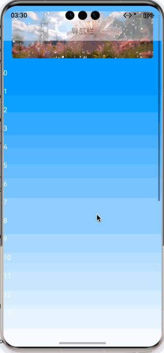

# 如何实现沉浸式导航栏渐变效果

自定义导航栏，上滑是逐渐淡入、下滑后淡出效果。

预览效果：



1、使用Stack布局，将滚动组件放到自定义导航栏的底层。

```extendtypescript
Stack() {
  Column() {
    List({ scroller: this.listScroller, space: 25 }) {

    }
  }
  this.navbar()
}
.width('100%')
.height('100%')
.alignContent(Alignment.Top)
```


2、开启沉浸式，并获取顶部安全区域高度，

```extendtypescript
const context = this.getUIContext().getHostContext()
if (context) {
  window.getLastWindow(context).then((win: window.Window) => {
    win.setWindowLayoutFullScreen(true)
    const topArea = win.getWindowAvoidArea(window.AvoidAreaType.TYPE_SYSTEM);
    this.topAreaHeight = this.getUIContext().px2vp(topArea.topRect.height)
  })
}
```


3、监听List列表组件的onDidScroll方法，根据滚动的偏移量，动态计算导航栏的透明度。

滚动偏移量大于导航栏高度则完全显示导航栏，否则使用滚动偏移量除以导航栏高度的值作为透明度。

```extendtypescript
 .
onDidScroll((scrollOffset: number, scrollState: ScrollState) => {
  const offsetY = this.listScroller.currentOffset().yOffset
  const navHeight = this.getNavHeight()
  if (offsetY <= navHeight) {
    this.navOpacity = offsetY / navHeight;
  } else {
    this.navOpacity = 1;
  }
})
```


4、完整的demo:

```extendtypescript
/**
 * @fileName : NavbarGradient.ets
 * @author : @cxy
 * @date : 2025/12/22
 * @description : 导航栏沉浸式渐变效果
 */
import { window } from "@kit.ArkUI";

@Component
export struct NavbarGradient {
@State topAreaHeight: number = 0
@State navOpacity: number = 0
@State list: string[] = []
private listScroller: ListScroller = new ListScroller()

aboutToAppear(): void {
  const context = this.getUIContext().getHostContext()
  if (context) {
    window.getLastWindow(context).then((win: window.Window) => {
      win.setWindowLayoutFullScreen(true)
      const topArea = win.getWindowAvoidArea(window.AvoidAreaType.TYPE_SYSTEM);
      this.topAreaHeight = this.getUIContext().px2vp(topArea.topRect.height)
    })
  }

  const list: string[] = []
  for (let index = 0; index < 30; index++) {
    list.push(index.toString())
  }
  this.list = list
}

build() {
  Stack() {
    Column() {
      List({ scroller: this.listScroller, space: 25 }) {
        ListItem() {
          Image($r('app.media.banner'))
            .aspectRatio(3 / 1)
            .width('100%')
            .borderRadius(8)
        }
        .padding({ left: 20, right: 20, top: 50 })

        ForEach(this.list, (item: string) => {
          ListItem() {
            Text(item)
              .fontColor('#fff')
          }
        }, (item: string) => item)
      }
      .layoutWeight(1)
      .onDidScroll((scrollOffset: number, scrollState: ScrollState) => {
        const offsetY = this.listScroller.currentOffset().yOffset
        const navHeight = this.getNavHeight()
        if (offsetY <= navHeight) {
          this.navOpacity = offsetY / navHeight;
        } else {
          this.navOpacity = 1;
        }
      })
    }
    .width('100%')
    .height('100%')
    .linearGradient({
      angle: 180,
      colors: [['#ff007bff', 0], ['#ffffffff', 1]]
    })

    this.navbar()
  }
  .width('100%')
  .height('100%')
  .alignContent(Alignment.Top)
}

@Builder
navbar() {
  Row() {
    Row() {
      Text('导航栏')
        .fontSize(18)
        .fontWeight(FontWeight.Medium)
    }
    .justifyContent(FlexAlign.Center)
    .width('100%')
    .height(44)
  }
  .backgroundColor('#fff')
  .opacity(this.navOpacity)
  .width('100%')
  .height(this.getNavHeight())
  .padding({ top: this.topAreaHeight })
}

getNavHeight(): number {
  return this.topAreaHeight + 44
}
}
```
