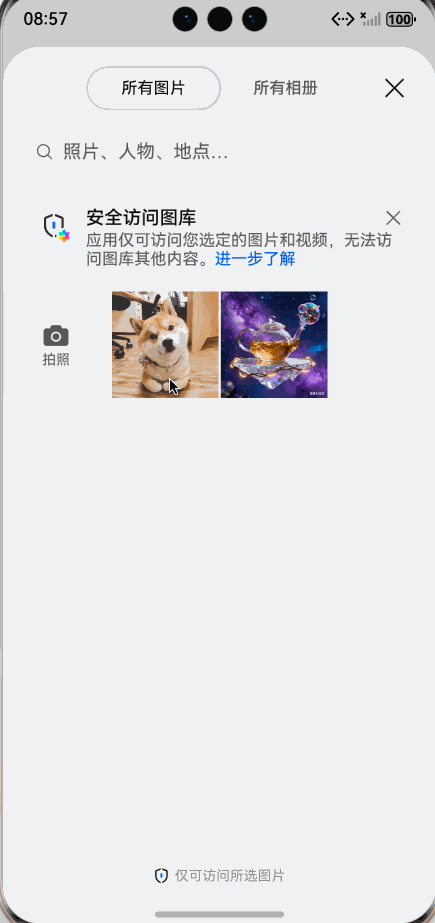

# 如何上传图片到阿里云OSS
实现选择图片，然后上传到oss

先安装阿里云oss sdk
ohpm i @aliyun/oss

预览效果：


1、先封装一个友好易用的上传类工具，支持返回统一类型，上传完成关闭客户端连接。
```extendtypescript
/**
 * @fileName : OssUploader.ets
 * @author : @cxy
 * @date : 2025/12/20
 * @description : 阿里云oss上传
 */
import Client, { FilePath, RequestError } from '@aliyun/oss';

/**
 * OSS 临时凭证接口
 */
export interface OSSToken {
  AccessKeyId: string;
  AccessKeySecret: string;
  Expiration: string;
  SecurityToken: string;
}

/**
 * OSS 基础配置
 */
export interface OSSUploadConfig {
  bucket: string;
  endpoint: string;
  objectKey: string; // 上传后的文件 key
  filePath: string; // 本地文件路径
}

/**
 * 统一返回结果类型
 */
export interface OSSUploadResponse {
  success: boolean; // 是否成功
  message: string; //成功或者失败提示
  requestId?: string, //请求的id
  url?: string; // 上传成功后的url
}

/**
 * OSS 上传工具类
 */
export class OSSUploader {
  private client: Client | null = null;
  private defaultTimeout = 60000; // 默认超时时间

  /**
   * 静态上传方法
   * @param token OSS 临时凭证
   * @param config 上传配置
   */
  static async quickUpload(
    token: OSSToken,
    config: OSSUploadConfig
  ): Promise<OSSUploadResponse> {
    const uploader = new OSSUploader();
    return uploader.upload(token, config);
  }

  /**
   * 上传方法
   * @param token OSS 临时凭证
   * @param config 上传配置
   * @returns 统一格式的上传结果
   */
  async upload(
    token: OSSToken,
    config: OSSUploadConfig
  ): Promise<OSSUploadResponse> {

    if (!token.AccessKeyId || !token.AccessKeySecret) {
      return {
        success: false,
        message: 'OSS凭证：AccessKeyId/AccessKeySecret 不能为空',
      };
    }

    if (!config.bucket || !config.endpoint || !config.objectKey || !config.filePath) {
      return {
        success: false,
        message: '上传配置缺失：bucket/endpoint/objectKey/file 均为必填项',
      };
    }

    try {
      const client = this.initClient(token, config.endpoint);
      const uploadRes = await client.putObject({
        bucket: config.bucket,
        key: config.objectKey,
        data: new FilePath(config.filePath),
      });
      // 关闭客户端连接
      this.closeClient();

      const statusCode = uploadRes.origRes.status;
      if (statusCode === 200) {
        return {
          success: true,
          message: '上传成功',
          url: this.generateFileUrl(config.bucket, config.endpoint, config.objectKey),
        };
      } else {
        return {
          success: false,
          message: `上传失败：状态码 ${statusCode}`,
          requestId: uploadRes.origRes.request?.id
        };
      }
    } catch (err) {
      this.closeClient();
      let errorMsg = '上传失败：未知错误';
      if (err instanceof RequestError) {
        errorMsg = `OSS 请求错误：${err.message}（请求 ID：${err.requestId || '无'}）`;
      } else if (err instanceof Error) {
        errorMsg = `上传异常：${err.message}`;
      } else if (err) {
        errorMsg = `上传异常：${JSON.stringify(err)}`;
      }
      return {
        success: false,
        message: errorMsg,
        requestId: err?.requestId
      };
    }
  }

  /**
   * 初始化 OSS 客户端
   * @param token OSS 临时凭证
   * @param endpoint OSS 端点（如 oss-cn-hangzhou.aliyuncs.com）
   */
  private initClient(token: OSSToken, endpoint: string): Client {
    // 解析 region
    const region = endpoint.split('.')[0];

    const client = new Client({
      accessKeyId: token.AccessKeyId,
      accessKeySecret: token.AccessKeySecret,
      securityToken: token.SecurityToken,
      region,
      timeout: this.defaultTimeout,
    });

    this.client = client;
    return client;
  }

  /**
   * 关闭客户端连接（避免资源泄漏）
   */
  private closeClient(): void {
    if (this.client) {
      try {
        this.client.requestHandler.getSession().close();
      } catch (err) {
        console.warn('关闭 OSS 客户端连接失败:', err);
      } finally {
        this.client = null;
      }
    }
  }

  /**
   * 生成上传后的文件访问 URL
   * @param bucket 桶名
   * @param endpoint 端点
   * @param objectKey 文件 key
   */
  private generateFileUrl(bucket: string, endpoint: string, objectKey: string): string {
    return `https://${bucket}.${endpoint}/${objectKey}`;
  }
}

```

2、图片选择上传示例，获取相册中图片的uri,拷贝到沙箱，使用沙箱filePath上传。
```extendtypescript
/**
 * @fileName : OssDemo.ets
 * @author : @cxy
 * @date : 2025/12/20
 * @description : oss文件上传demo
 */
import { photoAccessHelper } from "@kit.MediaLibraryKit";
import { fileIo } from "@kit.CoreFileKit";
import { OSSToken, OSSUploadConfig, OSSUploader } from "./OssUploader";

@Component
export struct OssDemo {
  @State imgUrl: string = ''

  build() {
    Column({ space: 30 }) {
      if (this.imgUrl) {
        Image(this.imgUrl)
          .width(200)

        Button('上传图片')
          .onClick(() => {
            this.copyToSandBox(this.imgUrl)
          })
      } else {
        Button('选择图片')
          .onClick(() => {
            this.onPickerImage()
          })
      }

    }
    .width('100%')
    .height('100%')
    .alignItems(HorizontalAlign.Center)
    .justifyContent(FlexAlign.Center)
  }

  onPickerImage() {
    const photoSelectOptions = new photoAccessHelper.PhotoSelectOptions();
    photoSelectOptions.MIMEType = photoAccessHelper.PhotoViewMIMETypes.IMAGE_TYPE;
    photoSelectOptions.maxSelectNumber = 1;

    const photoPicker = new photoAccessHelper.PhotoViewPicker();
    photoPicker.select(photoSelectOptions).then((photoSelectResult: photoAccessHelper.PhotoSelectResult) => {
      const uri = photoSelectResult.photoUris[0]
      this.imgUrl = uri
    }).catch((err: BusinessError) => {
    });
  }

  async copyToSandBox(uri: string) {
    const context = this.getUIContext().getHostContext()
    if (!context) {
      return
    }

    const ext = uri.split('.').pop() || 'png'

    const tempDir = context.tempDir + '/'
    const cacheFilePath = tempDir + 'test.' + ext;
    const srcFile = fileIo.openSync(uri);
    const dstFile = fileIo.openSync(cacheFilePath, fileIo.OpenMode.READ_WRITE | fileIo.OpenMode.CREATE);
    await fileIo.copyFile(srcFile.fd, dstFile.fd);
    await fileIo.close(srcFile)
    await fileIo.close(dstFile)

    this.upload(cacheFilePath)
  }

  async upload(filePath: string) {
    const name = filePath.split('/').pop() || ''

    // 通常从接口获取
    const token: OSSToken = {
      AccessKeyId: 'your AccessKeySecret',
      AccessKeySecret: 'your AccessKeySecret',
      Expiration: '2025-12-21T13:30:15Z',
      SecurityToken: 'your SecurityToken',
    };

    const config: OSSUploadConfig = {
      bucket: 'your-bucket',
      endpoint: 'oss-cn-hangzhou.aliyuncs.com',
      objectKey: 'your-dir/' + name,
      filePath: filePath,
    };

    // 静态调用
    const result = await OSSUploader.quickUpload(token, config);
    if (result.success) {
      console.log('上传成功，文件URL：', result.url);
      this.getUIContext().getPromptAction().openToast({
        message: '上传成功',
        duration: 3000,
      })
    } else {
      console.error('上传失败：', result.message);
    }
  }
}
```

3、完整的demo: https://github.com/iHongRen/harmony-study-demo/tree/main/entry/src/main/ets/pages/oss