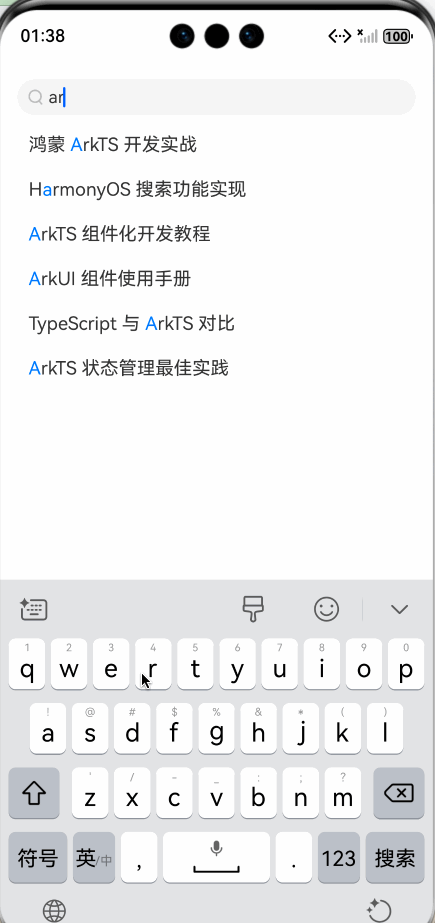

# 如何实现搜索关键词高亮

支持实时搜索，关键词忽略大小写，关键词高亮显示。

预览效果：


一、我们先自定义一个简单的搜索框

```extendtypescript
/**
 * @fileName : SearchBar.ets
 * @author : @cxy
 * @date : 2025/12/22
 * @description : 搜索框
 */


@Component
export struct SearchBar {
@Prop placeholder: string = '请输入搜索内容'
@Prop text: string = ''
onChanged?: (value: string) => void

build() {
  Row() {
    Row({ space: 5 }) {
      Image($r('[reslib].media.ic_search')).width(12)
      TextInput({ placeholder: this.placeholder || '请输入搜索内容', text: this.text })
        .placeholderColor('#999')
        .borderRadius(0)
        .backgroundColor(Color.Transparent)
        .fontSize(15)
        .placeholderFont({ size: 15 })
        .fontColor('#333')
        .maxLength(20)
        .padding(0)
        .enterKeyType(EnterKeyType.Search)
        .onChange((value: string) => {
          this.onChanged?.(value.trim())
        })
        .layoutWeight(1)
        .height(32)
    }
    .layoutWeight(1)
    .padding({ left: 10 })
    .justifyContent(FlexAlign.Start)
    .alignItems(VerticalAlign.Center)
    .height(32)
    .borderRadius('50%')
    .backgroundColor('#f6f6f6')
  }
  .alignItems(VerticalAlign.Center)
  .width('100%')
  .height(44)
  .backgroundColor('#fff')
}
}
```

二、高亮显示实现思路
将一段字符串根据关键词拆分为多个节点：
比如字符串“arkts搜索高亮”， 关键词为 'ts'，那么可以拆分为三个节点 [ark,ts,搜索高亮]。
定义节点为：

```extendtypescript
interface ResultNode {
text: string
highlight: boolean // 该text是否需要高亮
}
```

生成的节点数组结构为：

```extendtypescript
[
  {
    text: "ark",
    highlight: false
  },
  {
    text: "ts",
    highlight: true
  },
  {
    text: "搜索高亮",
    highlight: false
  },
]
```

渲染的时候，使用 Text + ForEach + Span

```extendtypescript
 Text() {
  // 循环生成Span节点
  ForEach(item.nodes, (node: ResultNode) => {
    Span(node.text)
      .fontColor(node.highlight ? '#0073ff' : '#333')
  })
}
```

三、完整demo源码：

```extendtypescript
/**
 * @fileName : SearchBar.ets
 * @author : @cxy
 * @date : 2025/12/22
 * @description : 搜索框
 */


@Component
export struct SearchBar {
@Prop placeholder: string = '请输入搜索内容'
@Prop text: string = ''
onChanged?: (value: string) => void

build() {
  Row() {
    Row({ space: 5 }) {
      Image($r('[reslib].media.ic_search')).width(12)
      TextInput({ placeholder: this.placeholder || '请输入搜索内容', text: this.text })
        .placeholderColor('#999')
        .borderRadius(0)
        .backgroundColor(Color.Transparent)
        .fontSize(15)
        .placeholderFont({ size: 15 })
        .fontColor('#333')
        .maxLength(20)
        .padding(0)
        .enterKeyType(EnterKeyType.Search)
        .onChange((value: string) => {
          this.onChanged?.(value.trim())
        })
        .layoutWeight(1)
        .height(32)
    }
    .layoutWeight(1)
    .padding({ left: 10 })
    .justifyContent(FlexAlign.Start)
    .alignItems(VerticalAlign.Center)
    .height(32)
    .borderRadius('50%')
    .backgroundColor('#f6f6f6')
  }
  .alignItems(VerticalAlign.Center)
  .width('100%')
  .height(44)
  .backgroundColor('#fff')
}
}
```