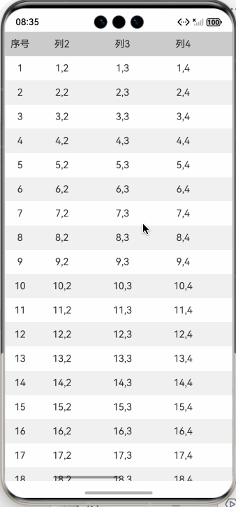

# 如何实现表格布局？

表格支持上下左右均可滚动

#### 预览效果：



#### 实现思路：

1、先将布局分为左右两个布局，左边使用List，右边使用Scroll+List
2、左右两边的表头使用 Group的header实现，右边的header是一个横向的List，并且设置不可滚动。
3、右边表的每一行都使用一个横向List实现，并且设置不可滚动。
4、右边表的横向滚动都交给Scroll来处理。
5、左右两边的List都需要把回弹效果关掉，避免滚动时两边不同步。

PS：demo演示使用的是ForEach，实际项目推荐使用LazyForEach以提升性能。

完整的demo:

```extendtypescript
/**
 * @fileName : Table.ets
 * @author : @cxy
 * @date : 2025/12/22
 * @description : 实现左右上下都可滑动的表格
 */

@Component
export struct Table {
@State titles: string[] = []
@State leftList: string[] = []
@State rightList: string[][] = []
private leftScroller: ListScroller = new ListScroller()
private rightScroller: ListScroller = new ListScroller()

aboutToAppear(): void {
  const leftList: string[] = []
  const rightList: string[][] = []

  for (let i = 0; i < 30; i++) {
    leftList.push((i + 1).toString())
    const items: string[] = []
    for (let j = 0; j < 10; j++) {
      items.push(`${i + 1},${j + 1}`)
    }
    rightList.push(items)
  }

  this.leftList = leftList
  this.rightList = rightList

  for (let j = 0; j < 10; j++) {
    this.titles.push(`列${j + 1}`)
  }
}

build() {
  Column() {
    Row() {
      this.leftBuilder()
      this.rightBuilder()
    }
    .alignItems(VerticalAlign.Center)
    .width('100%')
    .layoutWeight(1)
  }
  .width('100%')
  .height('100%')
}

@Builder
leftBuilder() {
  List({ scroller: this.leftScroller }) {
    ListItemGroup({ header: this.leftHeader() }) {
      // 通常需要使用 LazyForEach 提升性能
      ForEach(this.leftList, (item: string, index: number) => {
        ListItem() {
          Text(item)
            .height('100%')
            .width('100%')
            .textAlign(TextAlign.Center)
        }
        .height(40)
        .width('100%')
        .backgroundColor(index % 2 === 0 ? '#fff' : '#f0f0f0')
      }, (item: string) => item)
    }
  }
  .sticky(StickyStyle.Header)
  .width(50)
  .height('100%')
  .scrollBar(BarState.Off)
  .edgeEffect(EdgeEffect.None)
  .onDidScroll((scrollOffset: number, scrollState: ScrollState) => {
    if (scrollState !== ScrollState.Idle) {
      this.rightScroller.scrollTo({
        xOffset: 0,
        yOffset: this.leftScroller.currentOffset().yOffset
      })
    }
  })
}

@Builder
leftHeader() {
  Text('序号')
    .textAlign(TextAlign.Center)
    .height(40)
    .width(50)
    .backgroundColor('#ccc')
}

@Builder
rightBuilder() {
  Scroll() {
    List({ scroller: this.rightScroller }) {
      ListItemGroup({ header: this.rightHeader() }) {
        // 通常需要使用 LazyForEach 提升性能
        ForEach(this.rightList, (item: string[], index: number) => {
          ListItem() {
            this.rightListItem(item)
          }
          .height(40)
          .width('100%')
          .backgroundColor(index % 2 === 0 ? '#fff' : '#f0f0f0')
        }, (item: string) => item)
      }
    }
    .sticky(StickyStyle.Header)
    .width(10 * 100)
    .height('100%')
    .edgeEffect(EdgeEffect.None)
    .onDidScroll((scrollOffset: number, scrollState: ScrollState) => {
      if (scrollState !== ScrollState.Idle) {
        this.leftScroller.scrollTo({
          xOffset: 0,
          yOffset: this.rightScroller.currentOffset().yOffset
        })
      }
    })
  }
  .scrollable(ScrollDirection.Horizontal)
  .align(Alignment.TopStart)
  .height('100%')
  .layoutWeight(1)
}

@Builder
rightListItem(items: string[]) {
  List() {
    ForEach(items, (item: string, index: number) => {
      ListItem() {
        Text(item)
          .height('100%')
          .width('100%')
          .textAlign(TextAlign.Center)
      }
      .width(100)
    }, (item: string) => item)
  }
  .height('100%')
  .width('100%')
  .listDirection(Axis.Horizontal)
  .scrollBar(BarState.Off)
  .edgeEffect(EdgeEffect.None)
  .enableScrollInteraction(false)
}

@Builder
rightHeader() {
  List() {
    ForEach(this.titles, (item: string, index: number) => {
      ListItem() {
        Text(item)
          .height('100%')
          .width('100%')
          .textAlign(TextAlign.Center)
      }
      .width(100)
    }, (item: string) => item)
  }
  .backgroundColor('#ccc')
  .height(40)
  .width(this.titles.length * 100)
  .listDirection(Axis.Horizontal)
  .scrollBar(BarState.Off)
  .edgeEffect(EdgeEffect.None)
  .enableScrollInteraction(false)
}
}
```