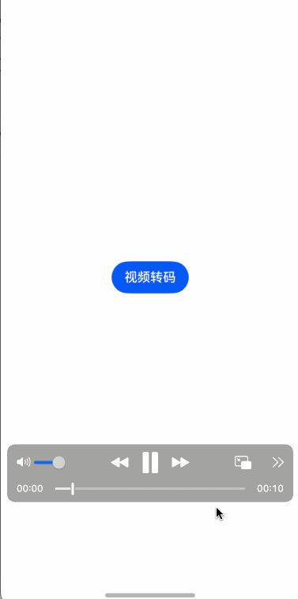

# 某些播放器和设备不支持HDR视频播放，怎么解决？

如何将HDR视频转为SDR视频？

参考文档[关于HDR和SDR](https://developer.huawei.com/consumer/cn/doc/best-practices/bpta-hdrvivid#section205681450115711)
首先需要理解HDR和SDR的根本区别：
HDR

- 高亮度：支持最高1000、4000、甚至10000尼特亮度。
- 宽色域：通常使用Rec.2020色彩空间，能显示更丰富、更鲜艳的颜色。
- 高比特深度：通常使用10-bit或12-bit，使得色彩过渡非常平滑，几乎看不到色阶断层。

SDR

- 低亮度：标准亮度约为100尼特。
- 窄色域：通常使用Rec.709色彩空间，色彩范围小。
- 低比特深度：传统为8-bit，现在也有10-bit SDR，但是亮度范围有限。

将HDR Vivid视频转码成SDR视频是一个涉及多个技术要点的复杂过程。
在Native侧可以使用AVCodec原生能力转码，而在Arkts侧使用AVTranscoder实现将HDR视频转SDR。

##### Demo预览:

转换后的SDR视频小了很多，兼容性也更好。


可以通过调用canIUse接口来判断当前设备是否支持AVTranscoder，当canIUse("SystemCapability.Multimedia.Media.AVTranscoder")
的返回值为true时，表示可以使用转码能力。

1、封装一个 Transcoder 类，方便直接调用转换

```extendtypescript
/**
 * @fileName : Transcoder.ets
 * @author : @cxy
 * @date : 2025/12/20
 * @description : 视频转码
 */

import { media } from '@kit.MediaKit';
import { BusinessError } from '@kit.BasicServicesKit';
import { fileIo } from '@kit.CoreFileKit';

export class Transcoder {
  processCallback?: (completed: boolean, progress: number, error?: BusinessError) => void
  private avTranscoder: media.AVTranscoder | undefined = undefined;
  private context: Context | undefined;
  private currentProgress: number = 0;
  private avConfig: media.AVTranscoderConfig = {
    audioBitrate: 100000, // 音频比特率。
    audioCodec: media.CodecMimeType.AUDIO_AAC, // 音频编码格式。
    fileFormat: media.ContainerFormatType.CFT_MPEG_4, // 封装格式。
    videoBitrate: 200000, // 视频比特率。
    videoCodec: media.CodecMimeType.VIDEO_AVC, // 视频编码格式。
  };

  constructor(context: Context | undefined) {
    if (context != undefined) {
      this.context = context;
    }
  }

  static canIUse() {
    return canIUse('SystemCapability.Multimedia.Media.AVTranscoder')
  }


  // 注册avTranscoder回调函数。
  setAVTranscoderCallback() {
    if (Transcoder.canIUse()) {
      if (this.avTranscoder != undefined) {
        // 转码完成回调函数。
        this.avTranscoder.on('complete', async () => {
          console.log(`AVTranscoder is completed`);
          this.processCallback?.(true, this.currentProgress)
          await this.releaseTranscoderingProcess();
        });
        // 错误上报回调函数。
        this.avTranscoder.on('error', (err: BusinessError) => {
          console.error(`AVTranscoder failed, code is ${err.code}, message is ${err.message}`);
          this.processCallback?.(false, this.currentProgress, err)
        });
        // 进度上报回调函数
        this.avTranscoder.on('progressUpdate', (progress: number) => {
          console.info(`AVTranscoder progressUpdate = ${progress}`);
          this.currentProgress = progress;
          this.processCallback?.(false, this.currentProgress)
        })
      }
    }
  }

  // 开始转码对应的流程。
  async startTranscoderingProcess(srcPath: string, dstPath: string) {
    if (Transcoder.canIUse()) {
      if (this.avTranscoder != undefined) {
        await this.avTranscoder.release();
        this.avTranscoder = undefined;
      }
      // 1.创建转码实例。
      this.avTranscoder = await media.createAVTranscoder();
      this.setAVTranscoderCallback();
      // 2.获取转码源文件fd和目标文件fd赋予avTranscoder；参考FilePicker文档。
      if (this.context != undefined) {
        try {
          let fileDescriptor = await fileIo.open(srcPath, fileIo.OpenMode.READ_ONLY);
          this.avTranscoder.fdSrc = fileDescriptor;

          let file = await fileIo.open(dstPath, fileIo.OpenMode.READ_WRITE | fileIo.OpenMode.CREATE);
          this.avTranscoder.fdDst = file.fd;
          this.currentProgress = 0;
        } catch (error) {
          console.error('error', error);
        }
      }
      // 3.配置转码参数完成准备工作。
      await this.avTranscoder.prepare(this.avConfig);
      // 4.开始转码。
      await this.avTranscoder.start();
    }
  }

  // 暂停转码对应的流程。
  async pauseTranscoderingProcess() {
    if (Transcoder.canIUse()) {
      if (this.avTranscoder != undefined) { // 仅在调用start返回后调用pause为合理调用。
        await this.avTranscoder.pause();
      }
    }
  }

  // 恢复对应的转码流程。
  async resumeTranscoderingProcess() {
    if (Transcoder.canIUse()) {
      if (this.avTranscoder != undefined) { // 仅在调用pause返回后调用resume为合理调用。
        await this.avTranscoder.resume();
      }
    }
  }

  // 释放转码流程。
  async releaseTranscoderingProcess() {
    if (Transcoder.canIUse()) {
      if (this.avTranscoder != undefined) {
        // 1.释放转码实例。
        await this.avTranscoder.release();
        this.avTranscoder = undefined;
        // 2.关闭转码目标文件fd。
        fileIo.closeSync(this.avTranscoder!.fdDst);
      }
    }
  }

  // 获取当前进度
  getCurrentProgress(): number {
    console.info(`getCurrentProgress = ${this.currentProgress}`);
    return this.currentProgress;
  }
}
```

2、使用示例，选择图库中的HDR视频，拷贝到沙箱后再进行转换。

```extendtypescript
/**
 * @fileName : TranscoderDemo.ets
 * @author : @cxy
 * @date : 2025/12/21
 * @description : 视频转码demo
 */
import { photoAccessHelper } from "@kit.MediaLibraryKit";
import { fileIo } from "@kit.CoreFileKit";
import { Transcoder } from "./Transcoder";

@Component
export struct TranscoderDemo {
@State message: string = ''
@State isTransing: boolean = false
@State progress: number = 0

build() {
  Column({ space: 30 }) {
    if (this.message) {
      Text(this.message)
        .fontSize(14)
    }

    Button(this.isTransing ? `正在转换：${this.progress}%` : '视频转码')
      .enabled(!this.isTransing)
      .onClick(() => {
        this.onPickerVideo()
      })
  }
  .width('100%')
  .height('100%')
  .alignItems(HorizontalAlign.Center)
  .justifyContent(FlexAlign.Center)
}

onPickerVideo() {
  const photoSelectOptions = new photoAccessHelper.PhotoSelectOptions();
  photoSelectOptions.MIMEType = photoAccessHelper.PhotoViewMIMETypes.VIDEO_TYPE;
  photoSelectOptions.maxSelectNumber = 1;

  const photoPicker = new photoAccessHelper.PhotoViewPicker();
  photoPicker.select(photoSelectOptions).then((photoSelectResult: photoAccessHelper.PhotoSelectResult) => {
    const uri = photoSelectResult.photoUris[0]
    this.copyToSandBox(uri)
  }).catch((err: BusinessError) => {
  });
}

async copyToSandBox(uri: string) {
  const context = this.getUIContext().getHostContext()
  if (!context) {
    return
  }
  const tempDir = context.filesDir + '/'
  const cacheFilePath = tempDir + 'test.mp4';
  const srcFile = fileIo.openSync(uri);
  const dstFile = fileIo.openSync(cacheFilePath, fileIo.OpenMode.READ_WRITE | fileIo.OpenMode.CREATE);
  fileIo.copyFileSync(srcFile.fd, dstFile.fd);

  const srcInfo = await fileIo.stat(srcFile.fd)

  const transPath = tempDir + 'trans.mp4'
  const path = await this.onTransCoder(cacheFilePath, transPath)
  if (!path) {
    console.error('转换失败')
    return
  }

  const trans = await fileIo.stat(path)

  const transInfo: Record<string, Object> = {
    '原大小': this.getSizeStr(srcInfo.size),
    '转码后大小': this.getSizeStr(trans.size),
    'dstPath': transPath
  }
  this.message = JSON.stringify(transInfo, null, 4)

  fileIo.close(srcFile)
  fileIo.close(dstFile)
}

async onTransCoder(srcPath: string, dstPath: string): Promise<string> {
  this.isTransing = true
  this.progress = 0
  return new Promise((resolve) => {
    const transcoder = new Transcoder(this.getUIContext().getHostContext())
    transcoder.startTranscoderingProcess(srcPath, dstPath)
    transcoder.processCallback = (completed: boolean, progress: number, error?: BusinessError) => {
      this.progress = progress
      if (completed) {
        this.isTransing = false
        resolve(dstPath)
      } else if (error) {
        this.isTransing = false
        resolve('')
      }
    }
  })
}

getSizeStr(size: number): string {
  if (size === 0) {
    return '0KB'
  } else if (size > 1024 * 1024 * 1024) {
    return Number(size / 1024.0 / 1024.0 / 1024.0).toFixed(1) + 'G'
  } else if (size > 1024 * 1024) {
    return Number(size / 1024.0 / 1024.0).toFixed(1) + 'M'
  } else {
    return Number(size / 1024.0).toFixed(1) + 'KB'
  }
}
}
```

3、完整的demo: https://github.com/iHongRen/harmony-study-demo/tree/main/entry/src/main/ets/pages