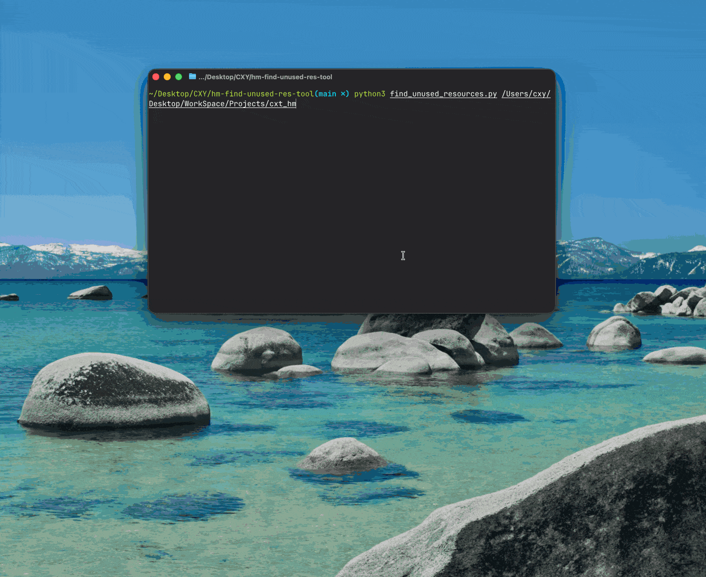

# 鸿蒙无用资源清理工具

扫描 HarmonyOS 项目中未使用的 media 和 rawfile 资源，自动弹出 GUI 面板，支持查看、打开、删除和导出报告。

环境要求：Python 3.9+，无需安装第三方依赖。

## 用法

```bash
python3 find_unused_resources.py [项目根目录]
```

不传参数时默认扫描当前目录。

## GUI 面板



- 双击 → 在文件管理器中打开
- 多选 → Cmd/Ctrl + 点击，支持批量删除
- 右键菜单 → 打开 / 复制名称 / 删除文件
- 键盘 → `Delete` 或 `⌫` 删除，`Return` 打开
- 导出报告 → 生成包含统计概览和分类明细的 TXT 报告
- 重新扫描 → 刷新资源分析结果

## 排除目录

默认跳过 `oh_modules`、`node_modules`、`.hvigor`、`build`、`.preview`、`AppScope`。
